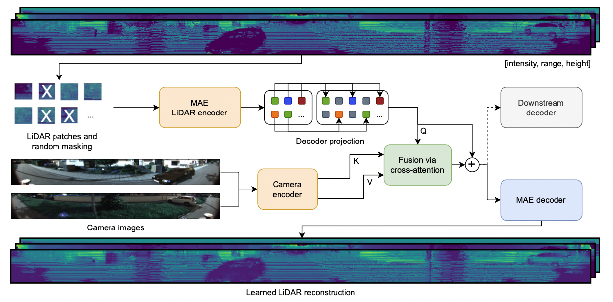

# MaskedFusion360

Reconstruct LiDAR data by querying camera features. Spherical projections of LiDAR data are transformed into patches, afterwards, randomly selected patches are removed and a MAE encoder is applied to the unmasked patches. The encoder output tokens are fused with camera features via cross-attention. Finally, a MAE decoder reconstructs the spherical LiDAR projections.

## Getting started
Coming soon...

## Acknowledgement
The masked autoencoder ([He et al., 2022](https://arxiv.org/abs/2111.06377)) and CrossViT ([Chen et al., 2021](https://arxiv.org/abs/2103.14899)) implementations are based on lucidrain's [vit_pytorch](https://github.com/lucidrains/vit-pytorch) library. 
